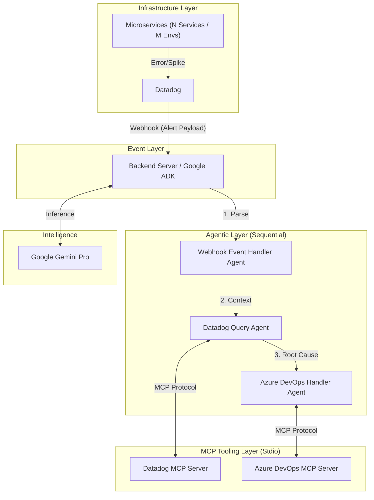
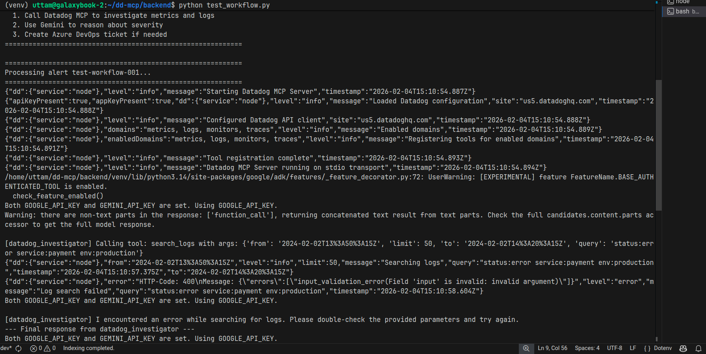
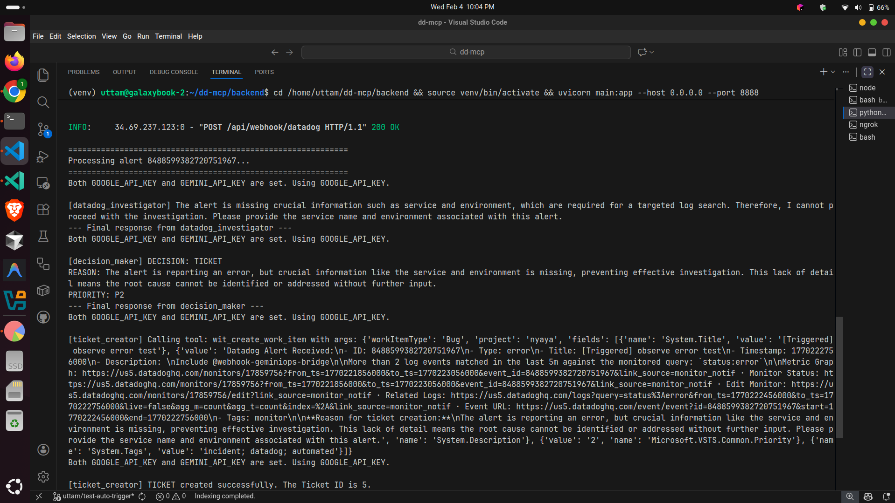
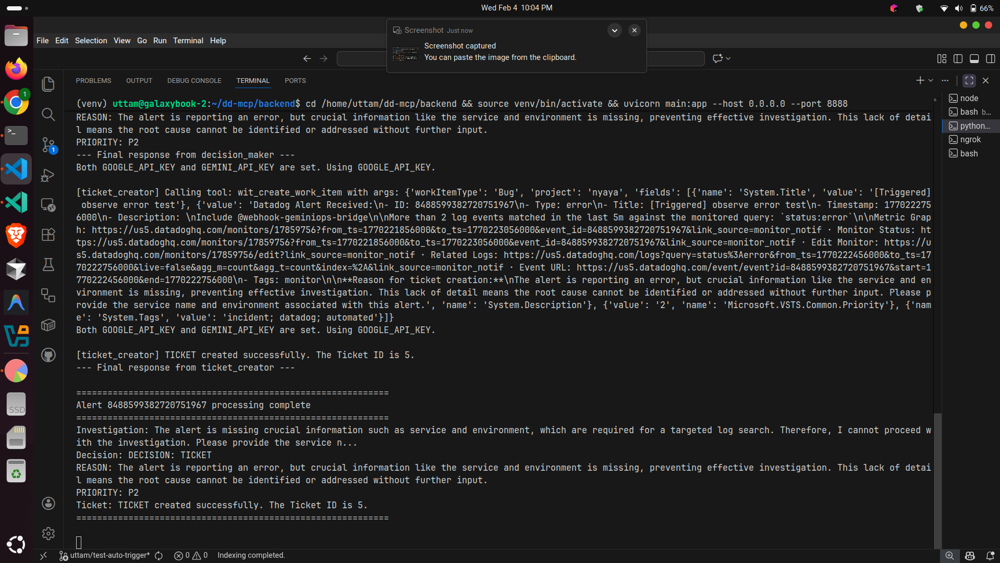

# **GeminiOps Bridge: Automated Incident Response with MCP**

**GeminiOps Bridge** is an autonomous incident response system that leverages the **Model Context Protocol (MCP)** and **Google's Agent Development Kit (ADK)** to bridge the gap between observability (Datadog) and project management (Azure DevOps).

When a microservice triggers an alert, this system acts as an intelligent SRE, investigating the root cause via Datadog and managing the resolution workflow in Azure DevOps using Gemini's reasoning capabilities.

## **🏗 Architecture**

The system operates on an event-driven architecture using a Sequential Agent pattern.


## **🚀 Key Features**

* **Model Context Protocol (MCP) Integration:** Uses the TypeScript SDK to run Datadog and Azure DevOps tools as local processes via stdio, allowing the Google ADK to securely execute tool calls.  
* **Sequential Agent Workflow:** A strictly typed pipeline ensures alerts are handled in a logical order (Receive \-\> Investigate \-\> Act).  
* **Context-Aware Analysis:** Gemini doesn't just read the alert; it queries historical metrics and logs surrounding the event time to determine validity.  
* **Automated Project Management:** Automatically creates Work Items, Bugs, or Tasks in Azure DevOps and assigns them to the correct engineering team based on service ownership.

## **📸 Screenshots**

### **1. Workflow Test Trigger**


### **2. Datadog Webhook Backend Execution**


### **3. AI Agent Investigation & Ticket Decision**


### **4. Azure DevOps Created Bug Ticket**


## **🤖 Agent Roles**

### **1\. Webhook Event Handler Agent**

**Trigger:** HTTP POST from Datadog Webhook.

**Responsibility:**

* Validates the incoming payload signature.  
* Extracts critical metadata: Alert ID, Service Name, Environment (e.g., Production/Staging), Metric Name, and Timestamp.  
* Passes a structured context object to the next agent.

### **2\. Datadog Query Agent (Investigator)**

**Tooling:** datadog-mcp-server

**Responsibility:**

* Receives context from the Webhook Agent.  
* **Tool Call:** Uses get\_metrics to look at CPU/RAM/Error rates 15 minutes before and after the alert.  
* **Tool Call:** Uses get\_logs to fetch stack traces associated with specific 500/400 error codes.  
* **Reasoning:** Summarizes the data to determine if this is a transient spike or a persistent failure.

### **3\. Azure DevOps Handler Agent (Executor)**

**Tooling:** azure-devops-mcp-server

**Responsibility:**

* Receives the "Investigation Report" from the Datadog Agent.  
* Decides if a ticket is necessary (e.g., skips if the error rate has already subsided).  
* **Tool Call:** Uses create\_work\_item to file a Bug.  
  * *Title:* \[Auto-Triage\] High Error Rate in {Service} on {Env}  
  * *Description:* Includes the Gemini-generated analysis and links to Datadog dashboards.  
* **Tool Call:** Uses assign\_work\_item to route the ticket to the specific team area path.

## **🛠 Prerequisites**

* **Node.js** (v18 or higher)  
* **Google Cloud Project** with Vertex AI API enabled.  
* **Datadog API Key & Application Key**.  
* **Azure DevOps PAT** (Personal Access Token) with Work Item write permissions.

## **📦 Project Structure**

```
/
├── backend/                    # Python FastAPI + Google ADK
│   ├── agent.py               # SequentialAgent definition
│   ├── main.py                # FastAPI webhook endpoint
│   ├── test_workflow.py       # Workflow test script
│   ├── requirements.txt       # Python dependencies
│   └── .env.example           # Environment variables template
├── datadog-mcp/               # Datadog MCP Server (TypeScript)
│   ├── src/
│   │   ├── index.ts           # Main MCP server entry
│   │   └── tools/             # Tool implementations
│   │       ├── metrics.ts     # query_metrics
│   │       ├── logs.ts        # search_logs
│   │       ├── monitors.ts    # get_monitor, list_monitors
│   │       └── traces.ts      # search_spans
│   └── package.json
├── azure-devops-mcp/          # Azure DevOps MCP Server (TypeScript)
│   ├── src/
│   │   ├── index.ts           # Main MCP server entry
│   │   └── tools/             # Tool implementations
│   └── package.json
└── README.md
```

## **🔧 Configuration**

Create a `.env` file in the `backend/` directory with your credentials:

```bash
# FastAPI Server
PORT=3000

# Google Gemini / ADK
GEMINI_API_KEY="your_gemini_api_key"
GOOGLE_API_KEY="your_google_api_key"

# Datadog MCP (passed to Datadog MCP server subprocess)
DD_API_KEY="your_dd_api_key"
DD_APP_KEY="your_dd_app_key"
DD_SITE="us5.datadoghq.com"

# Azure DevOps MCP (passed to Azure DevOps MCP server subprocess)
ADO_ORG_NAME="your-organization"
ADO_PROJECT="YourProject"
ADO_PAT="your_ado_pat"
ADO_MCP_AUTH_TOKEN="your_ado_pat"
AZURE_DEVOPS_ORG_URL="https://dev.azure.com/your-organization"
AZURE_DEVOPS_AUTH_METHOD="pat"
AZURE_DEVOPS_PAT="your_ado_pat"
AZURE_DEVOPS_DEFAULT_PROJECT="YourProject"
```

## **📥 Installation & Running**

### **1. Build MCP Servers (TypeScript)**

Both MCP servers need to be built before running the backend:

```bash
# Build Datadog MCP Server
cd datadog-mcp
npm install
npm run build

# Build Azure DevOps MCP Server
cd ../azure-devops-mcp
npm install
npm run build
```

### **2. Setup Python Backend**

```bash
cd backend

# Create virtual environment
python -m venv venv
source venv/bin/activate  # or venv\Scripts\activate on Windows

# Install dependencies
pip install -r requirements.txt

# Copy environment template and fill in your credentials
cp .env.example .env
# Edit .env with your actual API keys
```

### **3. Start the Backend Server**

```bash
cd backend
source venv/bin/activate
uvicorn main:app --host 0.0.0.0 --port 3000 --reload
```

The server will be available at `http://localhost:3000`

### **4. Test the Workflow**

```bash
# Run the test script
python test_workflow.py

# Or send a manual webhook
curl -X POST http://localhost:3000/api/webhook/datadog \
  -H "Content-Type: application/json" \
  -d '{
    "id": "test-001",
    "alert_type": "error",
    "title": "High CPU on prod-web-01",
    "date": 1704067200,
    "body": "CPU usage exceeded 90% threshold",
    "tags": ["env:prod", "service:web"]
  }'
```

### **5. Configure Datadog Webhook**

In your Datadog Dashboard:

1. Go to **Integrations** \-\> **Webhooks**.  
2. Create a new Webhook.  
3. URL: https://your-backend-url.com/api/webhook/datadog.  
4. Payload (JSON):  
   {  
     "id": "$ID",  
     "title": "$EVENT\_TITLE",  
     "body": "$TEXT\_ONLY\_MSG",  
     "date": "$DATE",  
     "event\_type": "$EVENT\_TYPE",  
     "host": "$HOSTNAME",  
     "service": "payment-service",   
     "environment": "production"  
   }

## **📖 Usage Examples**

### **Scenario A: HTTP 500 Spike**

1. **Alert:** Datadog detects \>5% error rate on auth-service.  
2. **Webhook:** Payload sent to Backend.  
3. **Datadog Agent:** Queries trace.servlet.request.error for the last 15 mins. Identifies a NullPointerException in the login handler.  
4. **ADO Agent:** Creates a Bug: "Critical: Auth Service NPE in Login". Assigns to "Identity Team".

### **Scenario B: Transient CPU Warning**

1. **Alert:** CPU \> 80% on worker-node-4.  
2. **Webhook:** Payload sent.  
3. **Datadog Agent:** Checks CPU history. Sees it dropped back to 40% immediately after the alert.  
4. **Reasoning:** Gemini identifies this as a safe, transient spike due to a scheduled cron job.  
5. **ADO Agent:** Logs the analysis but decides **not** to create a work item to avoid alert fatigue.

## **🛡 Security Note**

Since the MCP servers run via stdio, API keys for Datadog and ADO are kept server-side in the backend environment. They are never exposed to the public internet or the client-side.